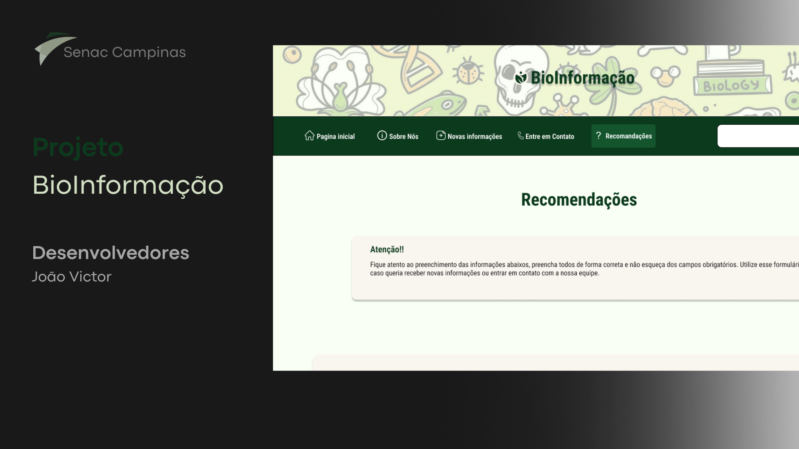

# Site de Biologia Básica 🐛

Este projeto é um site educativo focado em apresentar conceitos básicos sobre o universo da biologia. O site possui conteúdo organizado em cinco páginas, com tabelas, imagens e vídeos para facilitar o aprendizado.

<p align="center">
  
</p>

## Conteúdo 🧪

- Informações introdutórias sobre biologia 🧬
- Tabelas explicativas para organizar dados e conceitos 🌿
- Imagens ilustrativas para facilitar o entendimento 🦋
- Vídeos educativos incorporados nas páginas 🦠

## Estrutura do projeto 📂

- 5 páginas HTML interligadas
- Estilo visual desenvolvido com CSS
- Funcionalidades simples implementadas em Java

## Tecnologias utilizadas

- Java ⚙️(para funcionalidades interativas e backend, se aplicável)  
- HTML 🌐
- CSS 🎨

## Como usar

1. Clone este repositório:
   ```bash
   git clone https://Projeto_Programa-o_Senac.git

## Contribuições 🤝
Contribuições são bem-vindas! Sinta-se à vontade para abrir issues ou enviar pull requests.

## Licença 🔒 
Este projeto está licenciado sob a licença MIT. Veja o arquivo LICENSE para mais detalhes.

## Protótipo no Figma

<a href="https://www.figma.com/design/3C6tOp8lHuh0LeYIWMg2d5/Bioinforma%C3%A7%C3%A3o?node-id=1-3&t=Jh7GuUHTp3y8NJ7g-1" target="_blank">
  
</a>
